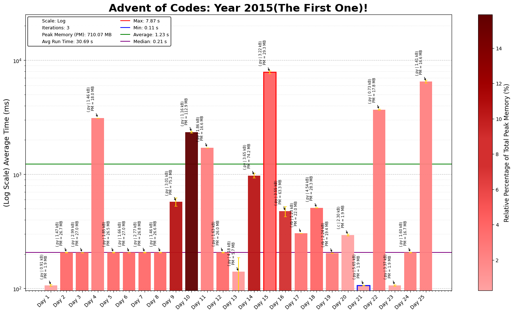

# 2015 Advent of Code

First attempt at solving the advent of code, pretty fun overall started off with a mix of Python and R, before umping into Ruby and C for more brute force and intensive codes for speed.

## Day-by-Day Coding Overview

1. **Day 1 - Not Quite Lisp**: Use character counting to track levels in a building, emphasizing string traversal and basic conditionals.
2. **Day 2 - I Was Told There Would Be No Math**: Apply array manipulation to compute surface areas and minimum perimeters for different 3D box dimensions.
3. **Day 3 - Perfectly Spherical Houses in a Vacuum**: Implement grid traversal with coordinate tracking to solve a path-following problem.
4. **Day 4 - The Ideal Stocking Stuffer**: Explore hashing functions (MD5) and brute-force search to find specific leading characters in hashes.
5. **Day 5 - Doesn't He Have Intern-Elves For This?**: Use regex or conditionals to validate strings based on rules, introducing string pattern-matching techniques.
6. **Day 6 - Probably a Fire Hazard**: Manipulate a 2D grid to track states, demonstrating array indexing and nested loops.
7. **Day 7 - Some Assembly Required**: Build a circuit simulator using recursion and memoization to evaluate logic gates.
8. **Day 8 - Matchsticks**: Calculate code size vs. in-memory size, emphasizing string escaping and encoding.
9. **Day 9 - All in a Single Night**: Solve a traveling salesman problem variant using permutations and brute-force shortest path algorithms.
10. **Day 10 - Elves Look, Elves Say**: Implement a look-and-say sequence generator with iterative string processing.
11. **Day 11 - Corporate Policy**: Use character incrementation for string-based password generation with custom rules.
12. **Day 12 - JSAbacusFramework.io**: Traverse and filter JSON-like nested data structures using recursion to sum values.
13. **Day 13 - Knights of the Dinner Table**: Apply backtracking to optimize seating arrangements with a 2D happiness matrix.
14. **Day 14 - Reindeer Olympics**: Simulate time-based racing dynamics, using modulo operations and conditional logic for tracking.
15. **Day 15 - Science for Hungry People**: Use constraint satisfaction and brute force to maximize scores within ingredient limits.
16. **Day 16 - Aunt Sue**: Filter a list of objects by attributes, emphasizing dictionary matching and conditional filtering.
17. **Day 17 - No Such Thing as Too Much**: Use combinations and recursion to find all ways to partition volumes, showing recursion and dynamic programming basics.
18. **Day 18 - Like a GIF For Your Yard**: Simulate cellular automata on a grid, emphasizing Conway’s Game of Life principles.
19. **Day 19 - Medicine for Rudolph**: Implement string replacement and transformation with a depth-first search (DFS) approach.
20. **Day 20 - Infinite Elves and Infinite Houses**: Use array manipulation and factors to simulate resource distribution efficiently.
21. **Day 21 - RPG Simulator 20XX**: Model turn-based game mechanics with simulations to minimize cost in player-vs-boss scenarios.
22. **Day 22 - Wizard Simulator 20XX**: Simulate a spell-based turn system with recursion and state management for optimizing outcomes.
23. **Day 23 - Opening the Turing Lock**: Write an interpreter for assembly-like instructions to simulate register operations.
24. **Day 24 - It Hangs in the Balance**: Apply dynamic programming and subsets to divide items into groups with target sums.
25. **Day 25 - Let It Snow**: Calculate coordinates using a custom encoding sequence and matrix manipulation to derive a target position’s code.

---

