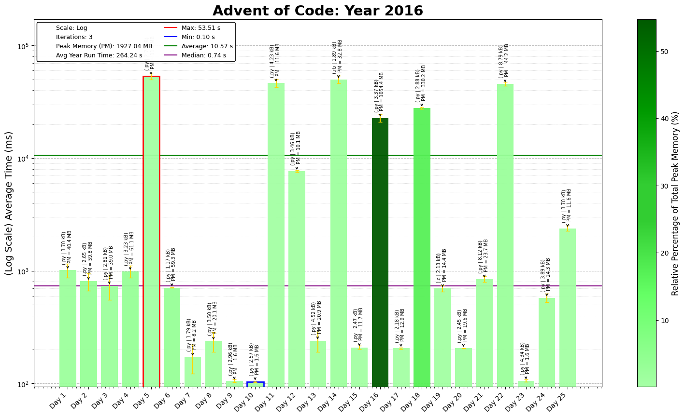

# 2016 Advent of Code
Second attempt at completing, tougher in a sene and required a lot of inspiration from other examples, but pretty fun overall. 
Especially enjoyed the shortest path problems and opportunity to switch through different languages.
Probably return to solve a couple of the problems again, focusing on speed.

## Day-by-Day Coding Overview

1. **Day 1 - No Time for a Taxicab**: Use coordinate tracking and direction vectors to navigate a grid based on movement commands.
2. **Day 2 - Bathroom Security**: Implement a keypad navigation with boundary checks, handling both simple and complex grid layouts.
3. **Day 3 - Squares With Three Sides**: Filter valid triangles from a list using column-based grouping and conditional checks.
4. **Day 4 - Security Through Obscurity**: Parse encrypted room names and calculate checksums, focusing on string manipulation and Caesar cipher decoding.
5. **Day 5 - How About a Nice Game of Chess?**: Generate hashes to create a password, emphasizing MD5 hashing and positional logic.
6. **Day 6 - Signals and Noise**: Parse frequency of characters across multiple columns, showing array counting and frequency analysis.
7. **Day 7 - Internet Protocol Version 7**: Detect patterns inside and outside brackets in a string to identify valid IPs, focusing on substring matching.
8. **Day 8 - Two-Factor Authentication**: Simulate a 2D pixel grid with on/off operations for display manipulation.
9. **Day 9 - Explosives in Cyberspace**: Decode a compressed string with recursive decompression, demonstrating string manipulation and recursion.
10. **Day 10 - Balance Bots**: Model a bot system where objects are passed and sorted, showing object-oriented design with complex interactions.
11. **Day 11 - Radioisotope Thermoelectric Generators**: Solve an elevator-based movement puzzle using breadth-first search to find the shortest path.
12. **Day 12 - Leonardo's Monorail**: Create an interpreter for a small assembly language, focusing on instruction parsing and register manipulation.
13. **Day 13 - A Maze of Twisty Little Cubicles**: Implement a maze traversal using BFS to explore reachable locations within movement limits.
14. **Day 14 - One-Time Pad**: Use hash generation and sliding window matching to generate a secure passphrase, emphasizing repeated hashing.
15. **Day 15 - Timing is Everything**: Solve a timing puzzle using modular arithmetic, simulating rotating discs and synchronization.
16. **Day 16 - Dragon Checksum**: Use bit manipulation to generate a data checksum following a specific expansion and reduction process.
17. **Day 17 - Two Steps Forward**: Implement a pathfinding algorithm with recursive backtracking to navigate a maze using hash-based keys.
18. **Day 18 - Like a Rogue**: Generate rows of tiles based on previous row patterns, demonstrating cellular automata and rule-based iteration.
19. **Day 19 - An Elephant Named Joseph**: Solve a variation of the Josephus problem using modular arithmetic to identify a specific survivor.
20. **Day 20 - Firewall Rules**: Optimize range merging to find unrestricted IPs, focusing on interval merging and boundary checks.
21. **Day 21 - Scrambled Letters and Hash**: Implement a series of string transformations to scramble or unscramble a password.
22. **Day 22 - Grid Computing**: Calculate viable moves in a file storage grid, emphasizing graph theory and finding minimal moves.
23. **Day 23 - Safe Cracking**: Modify and execute assembly instructions, showcasing instruction manipulation and optimization techniques.
24. **Day 24 - Air Duct Spelunking**: Use BFS to navigate a grid and visit all key points in the shortest possible path.
25. **Day 25 - Clock Signal**: Implement a clock-signal emulator using instruction interpretation to identify repeating sequences.

**Revisit later: take too long to run rn**
- Day 19 Part 2 in C
---

