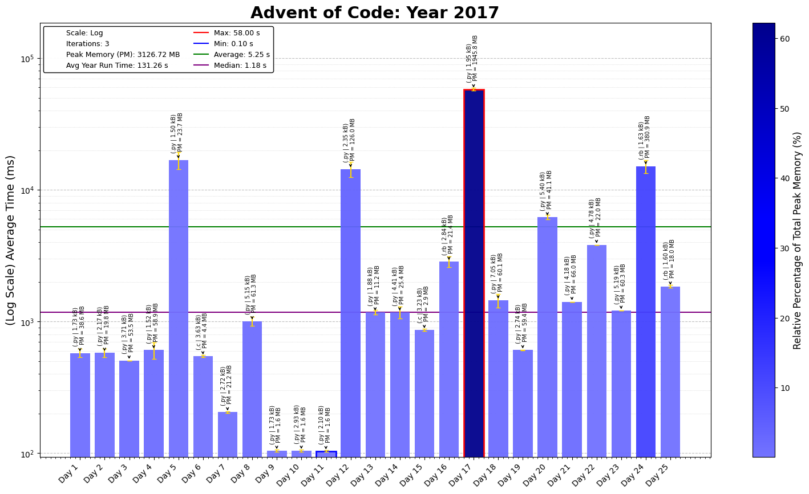

# 2017 Advent of Code

Pretty fun overall, last 5 were definitely some of the toughest ones yet but past examples helped out quite a bit. Continuing with expanding to C and Ruby for faster code.

## Day-by-Day Coding Overview

1. **Day 1 - Inverse Captcha**: Solve a digit-matching problem by comparing elements in a circular list, emphasizing array indexing and modular arithmetic.
2. **Day 2 - Corruption Checksum**: Calculate checksums by finding max-min differences and divisible pairs in a matrix, highlighting array manipulation and search algorithms.
3. **Day 3 - Spiral Memory**: Navigate a spiral grid, showing coordinate mapping and spiral traversal techniques.
4. **Day 4 - High-Entropy Passphrases**: Implement string sorting and frequency counting to detect duplicates and anagrams in passphrases.
5. **Day 5 - A Maze of Twisty Trampolines, All Alike**: Modify a list of instructions dynamically and iterate until all instructions are executed, demonstrating control flow and list mutation.
6. **Day 6 - Memory Reallocation**: Detect cycles in an array by tracking previously seen states, implementing cycle detection with lists.
7. **Day 7 - Recursive Circus**: Construct a tree of programs based on weight requirements, focusing on tree traversal and data dependency analysis.
8. **Day 8 - I Heard You Like Registers**: Parse and execute instructions to manage registers, using dictionaries and conditional operations for state tracking.
9. **Day 9 - Stream Processing**: Traverse nested structures while counting groups and ignoring garbage, emphasizing stack-based parsing.
10. **Day 10 - Knot Hash**: Implement a hashing function based on circular list manipulation and XOR folding, showing bitwise operations.
11. **Day 11 - Hex Ed**: Track movement on a hexagonal grid, emphasizing coordinate transformations for hex-based distance calculations.
12. **Day 12 - Digital Plumber**: Identify groups of connected nodes in a graph using DFS or BFS, illustrating graph traversal.
13. **Day 13 - Packet Scanners**: Model a firewall with periodic movements, using modular arithmetic to detect safe packet timing.
14. **Day 14 - Disk Defragmentation**: Apply binary conversions and a flood-fill algorithm to determine connected regions in a grid.
15. **Day 15 - Dueling Generators**: Generate sequences using bitwise operations and filtering for specific values, demonstrating bit masking and modulo operations.
16. **Day 16 - Permutation Promenade**: Simulate a dance sequence on a list using transformations, focusing on string manipulation and permutation cycles.
17. **Day 17 - Spinlock**: Implement circular buffer insertion with modular indexing, showing circular data structure manipulation.
18. **Day 18 - Duet**: Build a two-threaded message-passing simulator, emphasizing concurrency with separate instruction queues.
19. **Day 19 - A Series of Tubes**: Navigate a complex path on a grid, implementing directional movement and boundary detection.
20. **Day 20 - Particle Swarm**: Simulate particle movement with velocity and acceleration, using vector math and Manhattan distance for collision detection.
21. **Day 21 - Fractal Art**: Manipulate a 2D grid by applying transformation rules, highlighting grid subdivision and rotation.
22. **Day 22 - Sporifica Virus**: Model a virus spreading on a grid with state changes, using a dictionary-based 2D grid for dynamic expansion.
23. **Day 23 - Coprocessor Conflagration**: Interpret a custom assembly language, tracking instruction counts to optimize nested loops.
24. **Day 24 - Electromagnetic Moat**: Use recursive backtracking to build the strongest possible bridge from available components.
25. **Day 25 - The Halting Problem**: Simulate a Turing machine based on state transitions, showing the application of finite-state machines.

---
