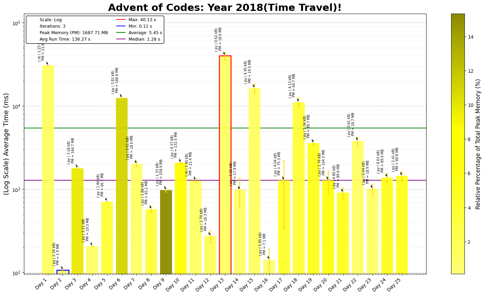

# Advent of Code 2018 - Coding Challenge Summaries

This repository contains coding solutions for the 2018 Advent of Code. Each day's challenge offers unique puzzles requiring efficient coding, algorithmic thinking, and optimization. These challenges emphasize data structures like trees, graphs, and grids, alongside dynamic programming, simulation, and optimization techniques.

## Day-by-Day Coding Overview

1. **Day 1 - Chronal Calibration**: Use cumulative summation to find frequency shifts, focusing on cycle detection with a set.
2. **Day 2 - Inventory Management System**: Implement character frequency counting and Levenshtein distance to identify similar IDs.
3. **Day 3 - No Matter How You Slice It**: Use a 2D grid to track overlapping fabric claims, demonstrating array manipulation.
4. **Day 4 - Repose Record**: Parse and sort logs by timestamps, applying frequency analysis to determine sleep patterns.
5. **Day 5 - Alchemical Reduction**: Use a stack to perform string reduction based on case-sensitive matching.
6. **Day 6 - Chronal Coordinates**: Identify regions closest to given points, focusing on grid traversal and boundary checks.
7. **Day 7 - The Sum of Its Parts**: Implement a topological sort to determine task order in a directed acyclic graph.
8. **Day 8 - Memory Maneuver**: Recursively parse tree nodes with metadata to calculate scores.
9. **Day 9 - Marble Mania**: Simulate a circular linked list to optimize insertion for a game involving marbles.
10. **Day 10 - The Stars Align**: Model points moving in 2D space, detecting convergence to form messages.
11. **Day 11 - Chronal Charge**: Apply a sliding window to find maximum power in a 2D grid.
12. **Day 12 - Subterranean Sustainability**: Simulate plant growth with rules, applying modulo optimization to identify cycles.
13. **Day 13 - Mine Cart Madness**: Simulate cart movement on a track grid, handling collision detection. First Look definitely created a sense of doom and dread, but eventually was able to break it into smaller problems to solve it and solve it overall. *A Personal Favourite*
14. **Day 14 - Chocolate Charts**: Implement a dynamic array for score updates in a simulated recipe generation.
15. **Day 15 - Beverage Bandits**: Simulate combat in a grid with pathfinding and state updates for characters.
16. **Day 16 - Chronal Classification**: Decode opcodes by analyzing register transformations, using sets to determine possibilities.
17. **Day 17 - Reservoir Research**: Simulate water flow in a grid, handling recursion and boundary detection.
18. **Day 18 - Settlers of The North Pole**: Model ecosystem evolution with cellular automata, identifying repeating states.
19. **Day 19 - Go With The Flow**: Implement a CPU-like register-based system to run instructions with specific rules.
20. **Day 20 - A Regular Map**: Use BFS on a grid to calculate minimum distances, based on regular expression parsing.
21. **Day 21 - Chronal Conversion**: Reverse-engineer code by tracking specific register conditions.
22. **Day 22 - Mode Maze**: Use Dijkstra’s algorithm to solve a pathfinding problem in a cave system.
23. **Day 23 - Experimental Emergency Teleportation**: Apply 3D range queries to find maximum overlap among spheres.
24. **Day 24 - Immune System Simulator 20XX**: Simulate a battle between units with different attributes, focusing on group interactions.
25. **Day 25 - Four-Dimensional Adventure**: Use a union-find algorithm to identify clusters in a 4D coordinate space.

**Revisit later: take too long to run rn**
- Day 21 Part 2 in C, around 20 mins
- Day 23 Part 2 in Python
---

