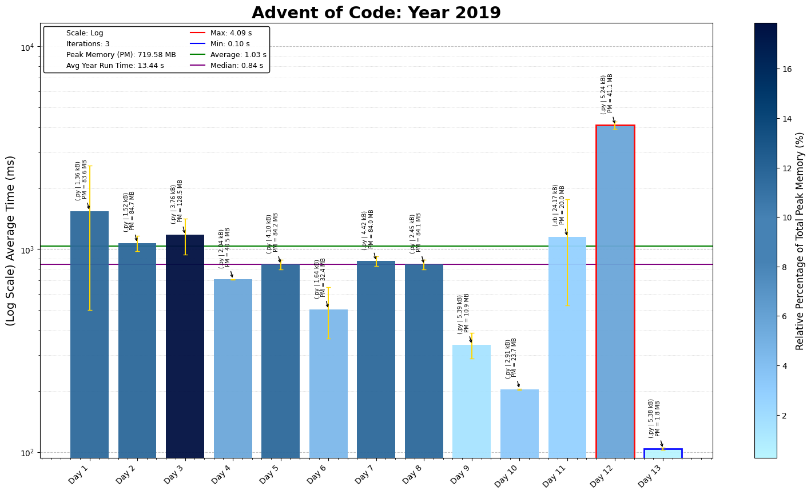

# Advent of Code 2019 - Coding Challenge Summaries

This repository contains coding solutions for the 2019 Advent of Code. Each day's problem involves complex simulations, graph theory, and optimization techniques.

## Day-by-Day Coding Overview

1. **Day 1 - The Tyranny of the Rocket Equation**: Use recursive calculations to compute fuel requirements based on mass.
2. **Day 2 - 1202 Program Alarm**: Implement a simple Intcode computer, focusing on list manipulation and opcode handling. `Intcode CPU` v1.0
3. **Day 3 - Crossed Wires**: Find intersection points on a grid, emphasizing coordinate mapping and distance calculations.
4. **Day 4 - Secure Container**: Use constraints on digit sequences to filter potential passwords.
5. **Day 5 - Sunny with a Chance of Asteroids**: Extend Intcode to handle parameters with multiple modes. `Intcode CPU` v2.0/2.1
6. **Day 6 - Universal Orbit Map**: Build a tree structure to represent orbits and calculate distances between nodes.
7. **Day 7 - Amplification Circuit**: Chain Intcode programs with feedback loops to maximize signal output. `Intcode Amplifiers` (v3.1)
8. **Day 8 - Space Image Format**: Parse layered image data, focusing on frequency counting and grid rendering.
9. **Day 9 - Sensor Boost**: Extend Intcode to support relative modes, enabling dynamic memory expansion.`Intcode CPU v4.0`
10. **Day 10 - Monitoring Station**: Calculate visibility using polar coordinates to determine optimal vantage points.
11. **Day 11 - Space Police**: Simulate a robot painting panels, using dictionaries for grid state management `Intcode Painters`.
12. **Day 12 - The N-Body Problem**: Model gravitational movement with vectors and identify cycles using LCM.
13. **Day 13 - Care Package**: Run Intcode to simulate a simple arcade game with paddle and ball interactions. `Intcode Arcade`
14. **Day 14 - Space Stoichiometry**: Use a recursive approach to track chemical production requirements.
15. **Day 15 - Oxygen System**: Apply BFS for maze exploration, identifying the shortest path to oxygen. `Intcode Explorers`
16. **Day 16 - Flawed Frequency Transmission**: Implement a custom FFT algorithm for signal processing.
17. **Day 17 - Set and Forget**: Use a grid pathfinding algorithm for robot navigation in a scaffold maze. `Intcode Navigators`
18. **Day 18 - Many-Worlds Interpretation**: Use BFS with keys and doors to navigate a complex graph.
19. **Day 19 - Tractor Beam**: Model a grid area with a program to test points for beam coverage. `Intcode Drones`
20. **Day 20 - Donut Maze**: Implement BFS for shortest paths in a multi-layered toroidal maze.
21. **Day 21 - Springdroid Adventure**: Develop a custom program for a robot using specific jumping rules. `Intcode Springdroid`
22. **Day 22 - Slam Shuffle**: Model a card shuffling algorithm using modular arithmetic.
23. **Day 23 - Category Six**: Implement a network of Intcode programs with inter-process communication.`Intcode Network`
24. **Day 24 - Planet of Discord**: Apply cellular automata to simulate a multi-layered ecosystem.
25. **Day 25 - Cryostasis**: Develop an Intcode interpreter with interaction for a text-based adventure game.`Intcode TextGame`

---

The 2019 challenges involve creating interpreters, pathfinding algorithms, and physics-based simulations, covering a variety of complex programming techniques.
