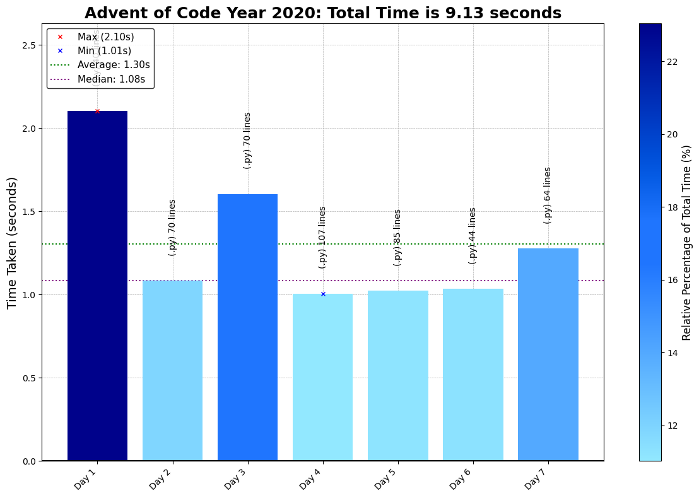

# Advent of Code 2020 - Coding Challenge Summaries

This repository contains coding solutions for the 2020 Advent of Code, with problems emphasizing recursion, state management, and efficient data structures.

## Day-by-Day Coding Overview

1. **Day 1 - Report Repair**: Use two-pointer or hashing techniques to find entries summing to a target value.
2. **Day 2 - Password Philosophy**: Parse rules and validate passwords based on character frequencies.
3. **Day 3 - Toboggan Trajectory**: Traverse a repeating grid pattern, handling 2D array indexing and boundary checks.
4. **Day 4 - Passport Processing**: Validate field constraints within structured input data, using regular expressions.
5. **Day 5 - Binary Boarding**: Decode seat locations using binary space partitioning.
6. **Day 6 - Custom Customs**: Use set operations to compute unique and shared answers within groups.
7. **Day 7 - Handy Haversacks**: Implement DFS or BFS to track dependencies within a directed graph of bag rules.
8. **Day 8 - Handheld Halting**: Simulate instruction execution to detect loops, focusing on state tracking.
9. **Day 9 - Encoding Error**: Apply a sliding window to find outlier sums, focusing on two-sum solutions.
10. **Day 10 - Adapter Array**: Calculate distinct paths through adapters, emphasizing dynamic programming.
11. **Day 11 - Seating System**: Model state changes in a grid using cellular automata.
12. **Day 12 - Rain Risk**: Simulate directional movement based on instructions, applying vector math for position tracking.
13. **Day 13 - Shuttle Search**: Use modular arithmetic and the Chinese Remainder Theorem to align bus schedules.
14. **Day 14 - Docking Data**: Use bit masking to apply memory updates, emphasizing bitwise manipulation.
15. **Day 15 - Rambunctious Recitation**: Track number occurrences to implement a custom memory game.
16. **Day 16 - Ticket Translation**: Parse and match fields against constraints, applying set theory.
17. **Day 17 - Conway Cubes**: Simulate a 3D and 4D version of Conway's Game of Life.
18. **Day 18 - Operation Order**: Implement a custom parser to evaluate mathematical expressions with unique precedence.
19. **Day 19 - Monster Messages**: Use regex and recursive pattern matching for grammar-based parsing.
20. **Day 20 - Jurassic Jigsaw**: Solve a jigsaw puzzle by matching image tiles, implementing matrix manipulation.
21. **Day 21 - Allergen Assessment**: Track food ingredients and allergens, using set intersections and constraint propagation.
22. **Day 22 - Crab Combat**: Simulate a card game with recursive gameplay, handling state hashing.
23. **Day 23 - Crab Cups**: Implement a circular linked list for efficient manipulation of cup sequences.
24. **Day 24 - Lobby Layout**: Model hexagonal grid changes based on a sequence of moves, using set-based toggling.
25. **Day 25 - Combo Breaker**: Implement the Diffie-Hellman key exchange protocol for cryptographic handshakes.

**Revisit later: take too long to run rn**
- Day 11 takes around 30s in Python
- Day 15 takes around 20s in Python
- Day 20 P2, reconsider approach
---

The 2020 challenges explore recursion, state management, and set operations, with several puzzles on grid traversal and sequence manipulations.

