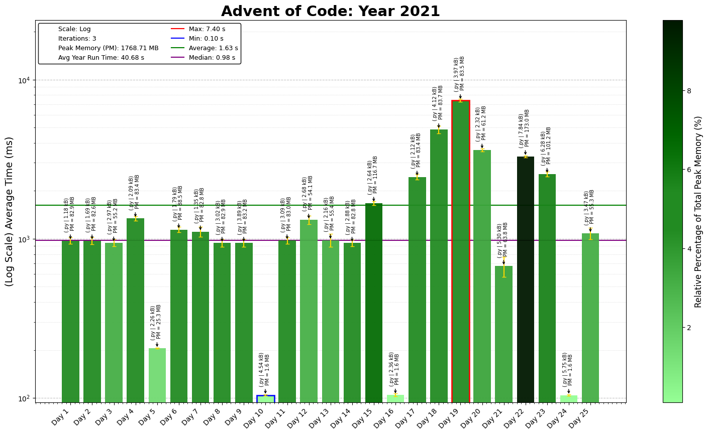

# Advent of Code 2021 - Coding Challenge Summaries

This repository contains coding solutions for the 2021 Advent of Code challenges, involving simulations, graph traversal, and advanced state management.

## Day-by-Day Coding Overview

1. **Day 1 - Sonar Sweep**: Apply sliding window to detect depth increases.
2. **Day 2 - Dive!**: Simulate submarine navigation, parsing commands.
3. **Day 3 - Binary Diagnostic**: Calculate power consumption using binary bitwise operations.
4. **Day 4 - Giant Squid**: Implement Bingo game with board marking and win detection.
5. **Day 5 - Hydrothermal Venture**: Track vent overlaps in a grid using coordinate mapping.
6. **Day 6 - Lanternfish**: Model exponential growth efficiently using arrays.
7. **Day 7 - The Treachery of Whales**: Calculate fuel for alignment using median and mean.
8. **Day 8 - Seven Segment Search**: Deduce segment mapping with constraint solving.
9. **Day 9 - Smoke Basin**: Detect basin sizes on a grid using flood fill.
10. **Day 10 - Syntax Scoring**: Parse and score syntax errors in nested brackets.
11. **Day 11 - Dumbo Octopus**: Simulate energy flashes on a grid with chain reactions.
12. **Day 12 - Passage Pathing**: Find all paths in a graph with constraints on revisits.
13. **Day 13 - Transparent Origami**: Simulate folding of paper using 2D array manipulation.
14. **Day 14 - Extended Polymerization**: Optimize polymer growth with pair counting.
15. **Day 15 - Chiton**: Implement pathfinding using Dijkstra's algorithm on weighted grids.
16. **Day 16 - Packet Decoder**: Parse and evaluate nested hexadecimal-encoded packets.
17. **Day 17 - Trick Shot**: Simulate projectile motion to hit target areas.
18. **Day 18 - Snailfish**: Implement arithmetic on snailfish numbers with complex nesting.
19. **Day 19 - Beacon Scanner**: Use 3D transformations to align overlapping beacons.
20. **Day 20 - Trench Map**: Enhance a grid with cellular automata based on algorithmic rules.
21. **Day 21 - Dirac Dice**: Simulate dice rolls with probabilistic branching.
22. **Day 22 - Reactor Reboot**: Model 3D space on/off toggling with cuboid intersection.
23. **Day 23 - Amphipod**: Solve an organization puzzle with A* pathfinding.
24. **Day 24 - Arithmetic Logic Unit**: Parse assembly-like instructions for input validation.
25. **Day 25 - Sea Cucumber**: Simulate sea cucumber movement in 2D with iterative updates.

---

These 2021 challenges emphasize efficient simulations, advanced parsing, and optimization in multi-dimensional grids and spaces.
