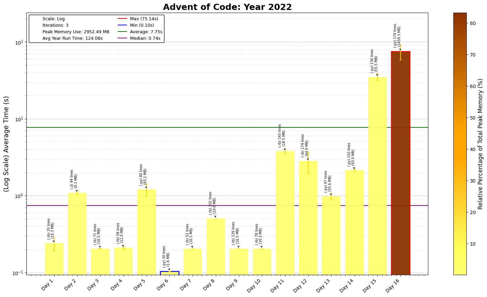

# Advent of Code 2022 - Coding Challenge Summaries

This repository contains coding solutions for the 2022 Advent of Code, focusing on grid manipulation, string parsing, and complex simulations.

## Day-by-Day Coding Overview

1. **Day 1 - Calorie Counting**: Parse and sum calorie lists to rank highest totals.
2. **Day 2 - Rock Paper Scissors**: Simulate game with custom scoring rules.
3. **Day 3 - Rucksack Reorganization**: Efficiently track item priorities with set intersections.
4. **Day 4 - Camp Cleanup**: Detect overlapping cleanup intervals using interval logic.
5. **Day 5 - Supply Stacks**: Simulate crane movements with stack operations.
6. **Day 6 - Tuning Trouble**: Implement a rolling buffer to find distinct substrings.
7. **Day 7 - No Space Left On Device**: Calculate directory sizes for storage optimization.
8. **Day 8 - Treetop Tree House**: Identify local maximums on a 2D grid for visibility.
9. **Day 9 - Rope Bridge**: Simulate movement with relative positioning of segments.
10. **Day 10 - Cathode-Ray Tube**: Render patterns from parsed signal cycles.
11. **Day 11 - Monkey in the Middle**: Calculate object inspections and trajectory adjustments. *50x speed up when switched from python to ruby*
12. **Day 12 - Hill Climbing Algorithm**: Apply pathfinding in a grid with elevation constraints.
13. **Day 13 - Distress Signal**: Parse and order complex lists based on custom rules.
14. **Day 14 - Regolith Reservoir**: Simulate particle behavior in a 2D grid environment.
15. **Day 15 - Beacon Exclusion Zone**: Track proximity constraints around beacons.
16. **Day 16 - Proboscidea Volcanium**: Plan optimal routes in a volcano with resource management.
17. **Day 17 - Pyroclastic Flow**: Model interactions between rock formations in 2D.
18. **Day 18 - Boiling Boulders**: Calculate surface area in a 3D lattice with intersections.
19. **Day 19 - Not Enough Minerals**: Plan resource production strategies for efficiency.
20. **Day 20 - Grove Positioning System**: Apply cyclic positioning with linked data.
21. **Day 21 - Monkey Math**: Construct equations with symbolic variables and evaluate.
22. **Day 22 - Monkey Map**: Map routes using conditional branching and directional logic.
23. **Day 23 - Unstable Diffusion**: Model movement and settling of particles in 2D.
24. **Day 24 - Blizzard Basin**: Use BFS to navigate a dynamic, changing environment.
25. **Day 25 - Full of Hot Air**: Convert numbers with a custom base-5 encoding scheme.

---

The 2022 challenges explore 2D/3D spatial reasoning, set manipulations, and creative string processing.
