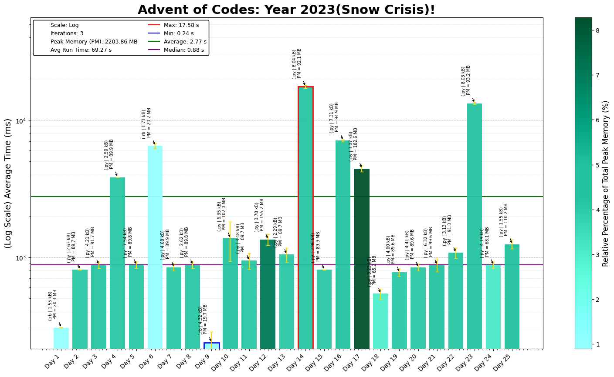
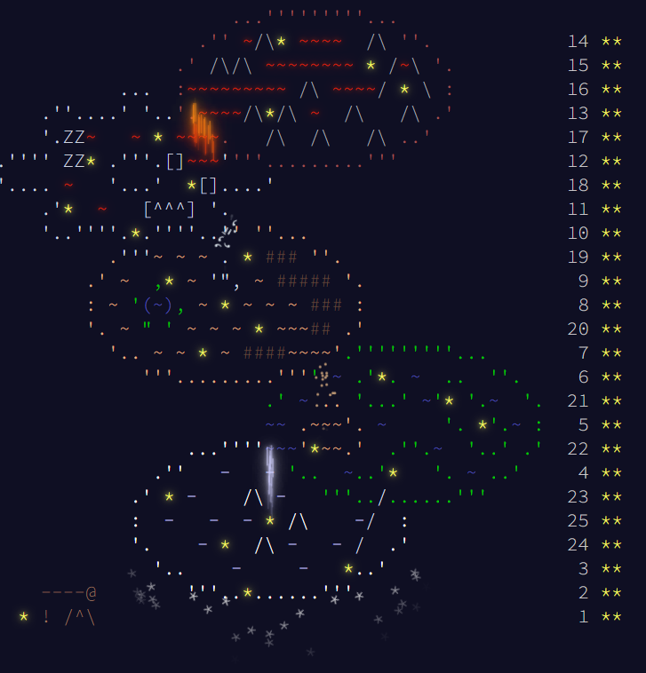

# Advent of Code 2023 - Coding Challenge Summaries

This repository contains coding solutions for the 2023 Advent of Code, focusing on algorithm optimization, dynamic simulations, and graph traversal techniques.

## Day-by-Day Coding Overview

1. **Day 1 - Trebuchet?!**: Parse and sum digit-extracted values from strings.
2. **Day 2 - Cube Conundrum**: Evaluate game conditions with bag constraints.
3. **Day 3 - Gear Ratios**: Locate adjacent numbers and symbols in a 2D grid.
4. **Day 4 - Scratchcards**: Simulate scoring and exponential card duplication.
5. **Day 5 - If You Give a Seed a Fertilizer**: Map ranges across transformations efficiently.
6. **Day 6 - Wait For It**: Optimize race timing for maximum distance.
7. **Day 7 - Camel Cards**: Rank and compare hands based on custom poker rules.
8. **Day 8 - Haunted Wasteland**: Simulate graph traversal using direction sequences.
9. **Day 9 - Mirage Maintenance**: Predict sequence values using differences.
10. **Day 10 - Pipe Maze**: Traverse loops in a grid-based pipe system.
11. **Day 11 - Cosmic Expansion**: Adjust galaxy distances with expanded rows and columns.
12. **Day 12 - Hot Springs**: Use dynamic programming to validate spring patterns.
13. **Day 13 - Point of Incidence**: Reflect 2D grids and detect symmetry points.
14. **Day 14 - Parabolic Reflector Dish**: Simulate rolling objects under gravity in 2D.
15. **Day 15 - Lens Library**: Hash strings and simulate lens box operations.
16. **Day 16 - The Floor Will Be Lava**: Simulate light reflection and splitting in grids.
17. **Day 17 - Clumsy Crucible**: Use A* search to find optimal paths with heat loss.
18. **Day 18 - Lavaduct Lagoon**: Calculate areas using path-based coordinates.
19. **Day 19 - Aplenty**: Apply rule-based workflows to filter and sum parts.
20. **Day 20 - Pulse Propagation**: Simulate signal propagation through flip-flop modules.
21. **Day 21 - Step Counter**: Use BFS to count reachable grid cells within steps.
22. **Day 22 - Sand Slabs**: Simulate falling blocks and compute stable configurations.
23. **Day 23 - A Long Walk**: Optimize pathfinding through forest-like maps.
24. **Day 24 - Never Tell Me The Odds**: Predict projectile intersections with physics constraints.
25. **Day 25 - Snowverload**: Solve a graph cut problem to disconnect critical systems.

---

The 2023 challenges highlight graph traversal, numerical optimization, and efficient simulation strategies.

