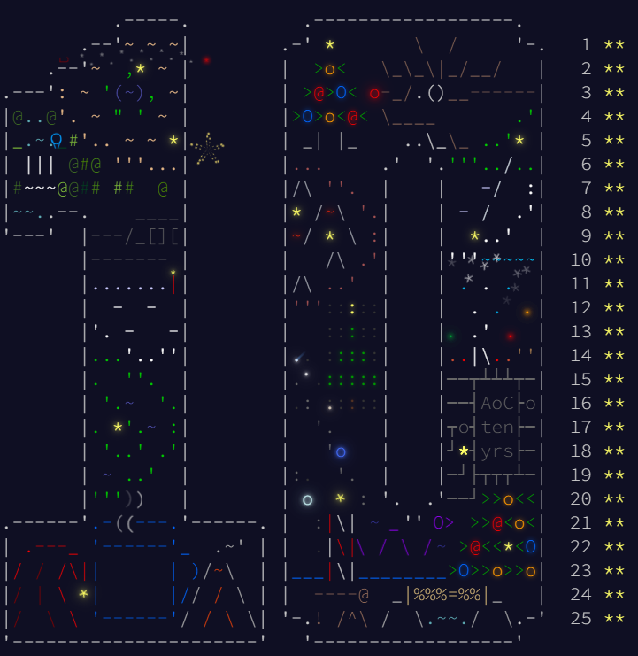

# Advent of Code 2024 - Coding Challenge Summaries

This repository contains coding solutions for the 2024 Advent of Code. Its the first time I am doing one as it is released so should be interesting

## Day-by-Day Coding Overview

1. **Day 1- Historian Hysteria**: *Ruby* | Sort number lists and count their differences. Pretty simple overall, provided i didn't make reading mistakes, but life goes on
2. **Day 2- Red-Nosed Reports** *Julia* | Validate number lists according to different criteria, Part 1 was simple, complicated Part 2 way too much initially.
3. **Day 3- Mull It Over**: *Python* | Used regex to find presence of all valid multiples, and then evaluate them. Seemed complicated originally until, you calm down and think of a clearer approach
4. **Day 4- Ceres Search**: *Python* | Used a bfs type search to create a word search algorithm in a letter grid. Adapted some Everybody Codes Quest code for this and then converted that to ruby
5. **Day 5- Print Queue**: *Julia* | Validating lists of numbers to match a set of rules, Fairly simple Part 1, Part 2 felt complicated until I looked at the megathread and found a different approach
6. **Day 6- Guard Gallivant**: *Ruby* | Pretty simple question overall with regards to the logic, but optimising it proved to be a fun challenge
7. **Day 7- Bridge Repair**: *Ruby* | Various permutations to build a target number with different blocks using the operators '+','*' and then '||'. Pretty simple once I realised i didn't have to permutate through all the operators
8. **Day 8- Resonant Collinearity**: *Ruby* | Find antinodes for any given antenna, Weird Wording which made the question really hard to understand
9. **Day 9- Disk Fragmenter**: *Ruby* | Free up disk space by removing empty space and rearranging files.
10. **Day 10- Hoof it**: *Python* | Simple BFS to find all valid paths on a 2d grid. Pretty standard algorithm that i adapted.
11. **Day 11- Plutonian Pebbles**: *Python* | Exponentially increasing lists, that becomes way more easy to solve when you switch to dictionaries and counters.
12. **Day 12- Garden Groups**: ** | Pretty simple neighbour searching algorithm, with some added complexity for finding perimeter and areas, Part 2 was kinda tough but got it in the end
13. **Day 13- Claw Contraption**: *Ruby* | Solving simultaneous equations, fairly simple ad could have solved it far faster if i simply used round instead of int from the start, but lesson learned
14. **Day 14- Restroom Redoubt**: *Python* | Particle Tracking in a grid, which was fairly simple, but finding the easter egg convinced me I never looked for one
15. **Day 15- Warehouse Woes**: *Python* | Moving elements in a grid according to a set of instructions, seems complicated but fairly manageable, once you work out a couple of edge cases. Not the most elegant solution, but definitely one of my favourite ones overall.
16. **Day 16- Reindeer Maze**: *Python* | A* search to find minimum path in a maze, adapted a fairly standard algorithm with the cost function.
17. **Day 17- Chronospatial Computer**: *Python* | Build an assembly computer with 8 main functions. Create a sort of disassembler that brute forces the solution
18. **Day 18- RAM Run**: *Python* | Path finder in a 2D grid, using BFS algorithm. Added a binary search to improve speed instead of initial brute force, resulting in a 8x speed up.
19. **Day 19- Linen Layout**: *Python* | Building words in using a group of blocks, finished in python cos it was easy.
20. **Day 20- Race Condition**: *Python* | Almost an inverse of Day 18, where I brute forced a solution for Part 1:, by removing individual walls, which worked but took almost 5 mins so switched approaches. Switching to the manhattan approach between start and end cheats, resulted in a 10x speed up. Adding the KDT function for iterating through times, further sped it up by 10x, for a 100x speed up overall.
21. **Day 21- Keypad Conundrum**: *Ruby* | While orignally I tried using a BFS to find path from each key to next, it became way tto memory intensive for the depths required in part 2, and switched to a more tailored algorithm focused on the absolute difference between two points
22. **Day 22- Monkey Market**: *Python* | Essentially about finding patterns in a list of random numbers, which I ended up using a dictionary of lists to find the optimum point across all the 1600 lists.
23. **Day 23- LAN Party**: *Python* | Used the gift of a library that is networkx, which may not be as elegant but it is a solution after all.
24. **Day 24- Crossed Wires**: *Python* | Built a circuit network, fairly simple Part 1, Found a relativey fast solution for Part 2 that works on my input, but seems to get stuck on the examples
25. **Day 25- Code Chronicle**: *Python* | Made some stupid assumptions about the problem, but otherwise fairly simple.

Overall, Really enjoyed the year, but Day 15 moving blocks was definitely my favourite

| Day | Part 1 Time | Part 1 Rank | Part 2 Time | Part 2 Rank |
|-----|-------------|-------------|-------------|-------------|
|  1  | 00:13:14    | 5227        | 00:24:15    | 5937        |
|  2  | 01:54:26    | 20049       | 02:23:10    | 15231       |
|  3  | 00:56:41    | 14969       | 01:41:19    | 15124       |
|  4  | 03:24:18    | 23576       | 04:40:47    | 24482       |
|  5  | 06:19:41    | 35055       | 06:46:08    | 28118       |
|  6  | 05:39:40    | 30452       | 07:10:21    | 19167       |
|  7  | 05:54:52    | 23847       | 06:19:13    | 22347       |
|  8  | 10:09:19    | 32410       | 10:50:04    | 30819       |
|  9  | 05:56:35    | 22580       | 07:35:04    | 16295       |
| 10  | 11:58:18    | 32095       | 12:59:56    | 32417       |
| 11  | 08:22:08    | 31446       | 09:22:44    | 23019       |
| 12  | 08:37:08    | 22880       | 12:39:53    | 17329       |
| 13  | 11:10:57    | 25599       | 11:46:32    | 20766       |
| 14  | 12:06:05    | 25850       | 13:42:33    | 22722       |
| 15  | 15:28:41    | 26593       | 19:24:16    | 19951       |
| 16  | 12:44:20    | 17404       | 12:52:57    | 12387       |
| 17  | 20:13:23    | 24630       | 21:42:37    | 14984       |
| 18  | 00:14:42    | 1491        | 00:23:21    | 1638        |
| 19  | 13:15:09    | 19979       | 13:16:58    | 17188       |
| 20  | 07:23:33    | 12207       | 18:29:34    | 15082       |
| 21  | 20:18:16    | 11734       | 22:19:28    | 8216        |
| 22  | 02:22:42    | 6129        | 04:46:10    | 6504        |
| 23  | 03:32:58    | 7897        | 03:51:30    | 6246        |
| 24  | 04:19:51    | 8862        | 06:31:48    | 3648        |
| 25  | 00:09:18    | 626         | 00:09:25    | 526         |
