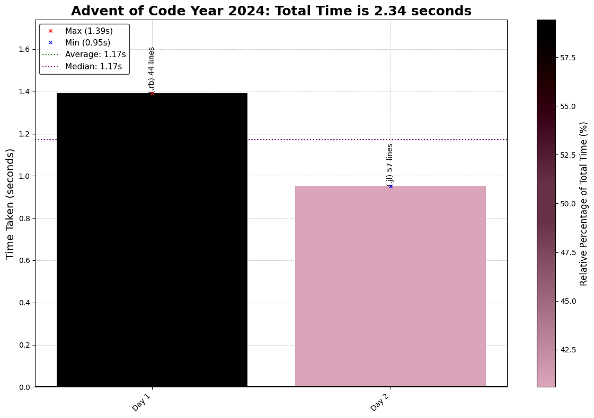

# Advent of Code 2024 - Coding Challenge Summaries

This repository contains coding solutions for the 2024 Advent of Code. Its the first time I am doing one as it is released so should be interesting

## Day-by-Day Coding Overview

1. **Day 1- Historian Hysteria**: *Ruby* Sort number lists and count their differences. Pretty simple overall, provided i didn't make reading mistakes, but life goes on
2. **Day 2- Red-Nosed Reports** *Julia* Validate number lists according to different criteria, Part 1 was simple, complicated Part 2 way too much initially.