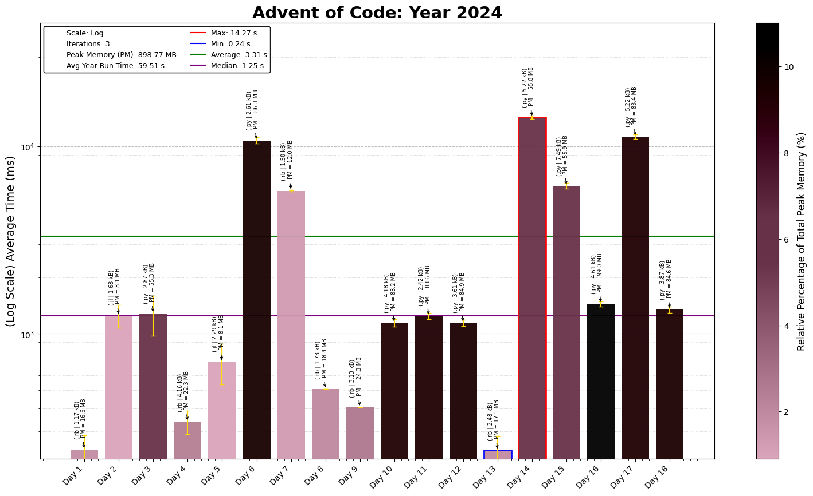

# Advent of Code 2024 - Coding Challenge Summaries

This repository contains coding solutions for the 2024 Advent of Code. Its the first time I am doing one as it is released so should be interesting

## Day-by-Day Coding Overview

1. **Day 1- Historian Hysteria**: *Ruby* | Sort number lists and count their differences. Pretty simple overall, provided i didn't make reading mistakes, but life goes on
2. **Day 2- Red-Nosed Reports** *Julia* | Validate number lists according to different criteria, Part 1 was simple, complicated Part 2 way too much initially.
3. **Day 3- Mull It Over**: *Python* | Used regex to find presence of all valid multiples, and then evaluate them. Seemed complicated originally until, you calm down and think of a clearer approach
4. **Day 4- Ceres Search**: *Python* | Used a bfs type search to create a word search algorithm in a letter grid. Adapted some Everybody Codes Quest code for this and then converted that to ruby
5. **Day 5- Print Queue**: *Julia* | Validating lists of numbers to match a set of rules, Fairly simple Part 1, Part 2 felt complicated until I looked at the megathread and found a different approach
6. **Day 6- Guard Gallivant**: *Ruby* | Pretty simple question overall with regards to the logic, but optimising it proved to be a fun challenge
7. **Day 7- Bridge Repair**: *Ruby* | Various permutations to build a target number with different blocks using the operators '+','*' and then '||'. Pretty simple once I realised i didn't have to permutate through all the operators
8. **Day 8- Resonant Collinearity**: *Ruby* | Find antinodes for any given antenna, Weird Wording which made the question really hard to understand
9. **Day 9- Disk Fragmenter**: *Ruby* | Free up disk space by removing empty space and rearranging files.
10. **Day 10- Hoof it**: *Python* | Simple BFS to find all valid paths on a 2d grid. Pretty standard algorithm that i adapted.
11. **Day 11- Plutonian Pebbles**: *Python* | Exponentially increasing lists, that becomes way more easy to solve when you switch to dictionaries and counters.
12. **Day 12- Garden Groups**: ** | Pretty simple neighbour searching algorithm, with some added complexity for finding perimeter and areas, Part 2 was kinda tough but got it in the end
13. **Day 13- Claw Contraption**: *Ruby* | Solving simultaneous equations, fairly simple ad could have solved it far faster if i simply used round instead of int from the start, but lesson learned
14. **Day 14- Restroom Redoubt**: *Python* | Particle Tracking in a grid, which was fairly simple, but finding the easter egg convinced me I never looked for one
15. **Day 15- Warehouse Woes**: *Python* | Moving elements in a grid according to a set of instructions, seems complicated but fairly manageable, once you work out a couple of edge cases. Not the most elegant solution, but definitely one of my favourite ones overall.
16. **Day 16- Reindeer Maze**: *Python* | A* search to find minimum path in a maze, adapted a fairly standard algorithm with the cost function.
17. **Day 17- Chronospatial Computer**: *Python* | Build an assembly computer with 8 main functions. Create a sort of disassembler that brute forces the solution
18. **Day 18- RAM Run**: *Python* | Path finder in a 2D grid, using BFS algorithm. Added a binary search to improve speed instead of initial brute force, resulting in a 8x speed up.
19. **Day 19- Linen Layout**: *Python* | Building words in using a group of blocks, finished in python cos it was easy.