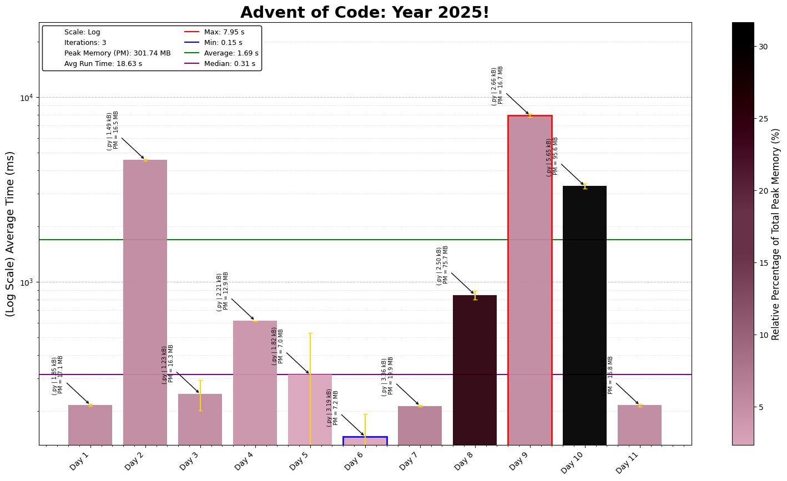

# Advent of Code 2025 - Coding Challenge Summaries

This repository contains coding solutions for the 2025 Advent of Code.

## Day-by-Day Coding Overview

1. **Day 1- Secret Entrance**: *Python* | Basic python code for rotating a list representing a dial, BUT basic is good.
2. **Day 2 - Gift Shop** *Python* | Identifying and counting invalid ids, but remember duplicating can be avoided using sets.
3. **Day 3 - Lobby** | *Python* | Maximising the number built in a list of numbers
4. **Day 4 - Printing Department**: *Python* | Pretty simple grid problem, and if you dont compute unnecessary things it runs faster.
5. **Day 5 - Cafeteria**: *Python* | Validating a set of numbers through a series of ranges, and then counting all the numbers.
6. **Day 6 - Trash Compactor**: *Python* | Reading a list of strings into numbers in a desired order is far from simple.
7. **Day 7 - Laboratories**: *Python* | BFS and DFS, the good ole AOC algorithms back to use.
8.**Day * - Playground**: *Python* | Union find is the name of the game.