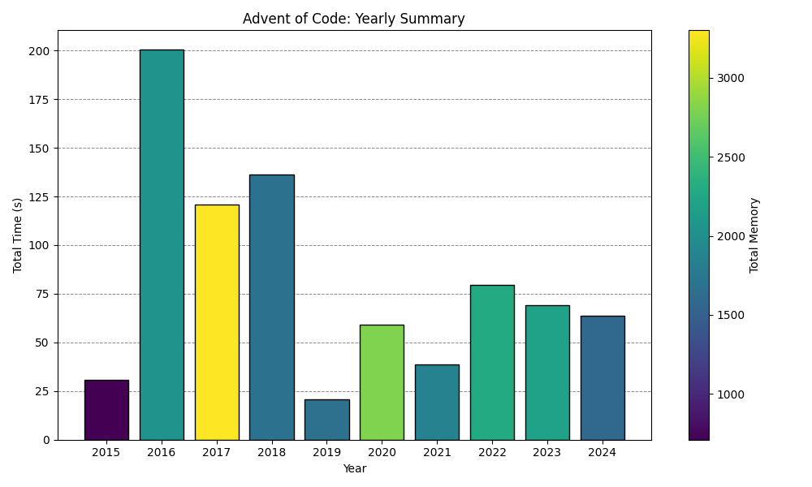

# Advent of Code 

Working through past Advent of Code problems starting all the way from 2015, in a mixture of Python and R, and maybe a few different languages as I learn them

This repository contains my solutions to the problems on [Advent of Code](https://adventofcode.com/), an annual series of programming challenges that are released every day in December.

## What is Advent of Code?

Advent of Code is an event that provides a series of daily programming challenges, starting on December 1st and ending on December 25th. Each challenge focuses on algorithmic problems that test your coding skills, problem-solving abilities, and understanding of data structures. The problems range from simple puzzles to complex, multi-part challenges.

## What’s in this Repository?

In this repository, you’ll find:
- Solutions to the daily problems from Advent of Code.
- Most problems are solved in Python, but may switch to other languages (e.g., C, Ruby) for performance or preference.
- The solutions are organized by year and day (e.g., `2024/01`, `2024/02`).
- Each day's folder contains a primary solution script (e.g., `YearDay01.py`, `YearDay02.py`), with alternative or older methods saved as `AltYearDay01.py`, `AltYearDay02.py`, etc.
- Each year folder also contains a `Run_2024.py` script that runs all the primary solutions for that year, and generates a runtime plot stored in the corresponding `README_2024.md`.

## How to Use
| Year | Stars | Time (s) | Languages        | Repository |
|------|-------|-----------------|------------------|------------|
| 2024 |26\*   |19.97 s |Julia/Python/Ruby| [GitHub](https://github.com/abbasmoosajee07/AdventofCode/tree/main/2024) |
| 2023 |       |                 |                  | [GitHub](https://github.com/abbasmoosajee07/AdventofCode) |
| 2022 | 46\*  | 95.21 s|Julia/Python/Ruby| [GitHub](https://github.com/abbasmoosajee07/AdventofCode/tree/main/2022) |
| 2021 | 50\*  | 40.67 s| Python/Ruby/C    | [GitHub](https://github.com/abbasmoosajee07/AdventofCode/tree/main/2021) |
| 2020 | 50\*  | 72.70 s| Python/Ruby/C    | [GitHub](https://github.com/abbasmoosajee07/AdventofCode/tree/main/2020) |
| 2019 | 24\*  | 13.31 s| Python/Ruby/C    | [GitHub](https://github.com/abbasmoosajee07/AdventofCode/tree/main/2019) |
| 2018 | 50\*  |154.41 s| Python/Ruby/C    | [GitHub](https://github.com/abbasmoosajee07/AdventofCode/tree/main/2018) |
| 2017 | 50\*  |131.25 s| Python/Ruby/C    | [GitHub](https://github.com/abbasmoosajee07/AdventofCode/tree/main/2017) |
| 2016 | 50\*  |264.24 s| Python/Ruby/C    | [GitHub](https://github.com/abbasmoosajee07/AdventofCode/tree/main/2016) |
| 2015 | 50\*  |530.01 s| Python/Ruby/C/R  | [GitHub](https://github.com/abbasmoosajee07/AdventofCode/tree/main/2015) |
| **Total** | **396\*** |                 |                  |            |

